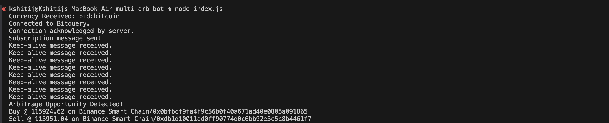

# Multichain Crypto Arbitrage Bot

The **Multichain Crypto Arbitrage Bot** leverages **[Bitquery’s real-time blockchain data streams](https://docs.bitquery.io/docs/streams/?utm_source=github_readme&utm_medium=referral&utm_campaign=multi_arb_bot&utm_content=bitquery_streaming_docs&utm_term=bitquery)** to detect and act on **cross-chain price discrepancies** across top decentralized exchanges (DEXs).

Built with **Node.js**, this bot subscribes to Bitquery’s **Crypto Price Stream (GraphQL/WebSocket)** to monitor live prices on multiple blockchains, compare USD-normalized values, and flag arbitrage opportunities instantly.

---

## 💡 Why Use Bitquery for Arbitrage?

Bitquery provides **real-time, unified blockchain data** ideal for arbitrage strategies:

- **Unified multichain data** → One **[Trading schema](https://docs.bitquery.io/docs/trading/crypto-price-api/introduction/?utm_source=github_readme&utm_medium=referral&utm_campaign=multi_arb_bot&utm_content=trading_api_overview&utm_term=trading)** for multiple chains and DEXs  
- **Easy to Use WebSocket streams** → **[Real-time subscriptions](https://docs.bitquery.io/docs/subscriptions/subscription/?utm_source=github_readme&utm_medium=referral&utm_campaign=multi_arb_bot&utm_content=graphql_subscriptions&utm_term=websocket_streams)** for OHLC and price updates  
- **USD-normalized quotes** → Compare cross-chain pairs consistently  
- **Flexible filters** → Target specific tokens, pairs, or markets dynamically  
- **Production-ready infra** → Enterprise-grade backend powering bots and dashboards 

👉 Explore **[Bitquery’s streaming APIs](https://docs.bitquery.io/docs/streams?utm_source=github_readme&utm_medium=referral&utm_campaign=multi_arb_bot&utm_content=bitquery_streams&utm_term=streams)** for more use cases.

---

## ⚙️ What You’ll Build

This repository walks you through building a **lightweight multichain arbitrage bot** that:

- Subscribes to **`Trading.Pairs`** via **Bitquery’s GraphQL WebSocket**
- Buffers incoming **price quotes** per DEX/chain
- Calculates **min/max price spreads** in real time
- Prints **“Arbitrage Opportunity Detected”** with buy/sell venues & spread size

Use this as a **template** to:
- Add your preferred tokens  
- Adjust **spread thresholds**  
- Extend the bot to **place trades** or **send alerts** automatically  

All powered by **Bitquery’s on-chain streaming infrastructure**.

---

## 👥 Who Is This For?

- **Developers** building on-chain trading bots or analytics dashboards  
- **Quant researchers** exploring cross-DEX efficiency  
- **Traders** interested in live arbitrage and **MEV** strategies  
- **Blockchain data engineers** testing Bitquery’s streaming performance  

---

## 🧩 Setup Guide

### 1️⃣ Create a Bitquery Account  
Create your account to get your **Access Token**:  
👉 [Sign Up on Bitquery](https://account.bitquery.io/auth/signup?utm_source=github_readme&utm_medium=referral&utm_campaign=multi_arb_bot&utm_content=bitquery_signup&utm_term=signup)

Then generate an **API Access Token**:  
🔑 [Get Access Tokens](https://account.bitquery.io/user/api_v2/access_tokens?utm_source=github_readme&utm_medium=referral&utm_campaign=multi_arb_bot&utm_content=api_tokens&utm_term=access_token)
Checkout [this document](https://docs.bitquery.io/docs/authorisation/how-to-generate/?utm_source=github_readme&utm_medium=referral&utm_campaign=multi_arb_bot&utm_content=api_tokens_guide&utm_term=access_token) for detailed instructions on creating Access Token.

---

### 2️⃣ Clone the Repository

```sh
git clone https://github.com/Kshitij0O7/multi-arb-bot.git?utm_source=github_readme&utm_medium=referral&utm_campaign=multi_arb_bot&utm_content=repo_link&utm_term=multi_arb_bot
cd multi-arb-bot
````

---

### 3️⃣ Install Dependencies

```sh
npm install
```

---

### 4️⃣ Configure Your Token

Create a `config.json` file in the root directory:

```json
{
  "oauthtoken": "<YOUR BITQUERY OAUTH TOKEN>"
}
```

---

## ▶️ Run the Bot

1. Add a token smart contract address — e.g., **BTC on Ethereum**:
   `0x2260fac5e5542a773aa44fbcfedf7c193bc2c599`

```js
run("0x2260fac5e5542a773aa44fbcfedf7c193bc2c599");
```

2. Start the bot:

```sh
node index.js
```

---

## 📊 Example Output

When an arbitrage opportunity is detected, the bot logs:

```
Arbitrage Opportunity Detected:
Buy on: Uniswap (ETH)
Sell on: PancakeSwap (BNB)
Spread: 2.14%
```



---

## 🧾 Technical Stack

| Component                      | Description                               | Link                                                                                                                                                                                                       |
| ------------------------------ | ----------------------------------------- | ---------------------------------------------------------------------------------------------------------------------------------------------------------------------------------------------------------- |
| **Bitquery Trading API**       | Unified blockchain data for multiple DEXs | [Docs](https://docs.bitquery.io/docs/trading/crypto-price-api/introduction/?utm_source=github_readme&utm_medium=referral&utm_campaign=multi_arb_bot&utm_content=trading_api_overview&utm_term=trading)                               |
| **Bitquery WebSocket Streams** | Real-time subscriptions for prices        | [WebSocket Docs](https://docs.bitquery.io/docs/subscriptions/subscription/?utm_source=github_readme&utm_medium=referral&utm_campaign=multi_arb_bot&utm_content=graphql_subscriptions&utm_term=websocket_streams) |
| **Node.js**                    | Runtime environment                       | [Node.js Setup](https://deb.nodesource.com/setup_20.x?utm_source=github_readme&utm_medium=referral&utm_campaign=multi_arb_bot&utm_content=node_setup&utm_term=node20)                                      |
| **Bitquery Account**           | Create & manage API keys                  | [Bitquery Account](https://account.bitquery.io/auth/signup?utm_source=github_readme&utm_medium=referral&utm_campaign=multi_arb_bot&utm_content=bitquery_signup&utm_term=signup)                            |

---

## 🪪 License

**MIT License © 2025 Multi-Arb Bot**

Free to use and modify — attribution to
**[Bitquery](https://bitquery.io/?utm_source=github_readme&utm_medium=referral&utm_campaign=multi_arb_bot&utm_content=bitquery_home&utm_term=bitquery)** appreciated.

---

### ✨ Powered by [Bitquery](https://bitquery.io/?utm_source=github_readme&utm_medium=referral&utm_campaign=multi_arb_bot&utm_content=bitquery_home&utm_term=bitquery)

Delivering **real-time, multichain blockchain data** through GraphQL, WebSocket, and Kafka streaming APIs.
